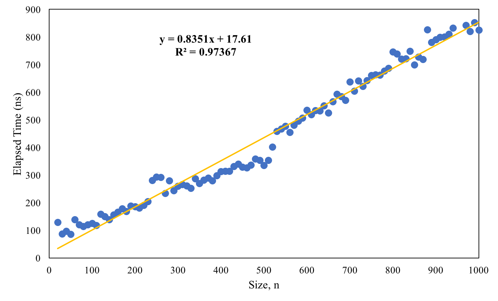
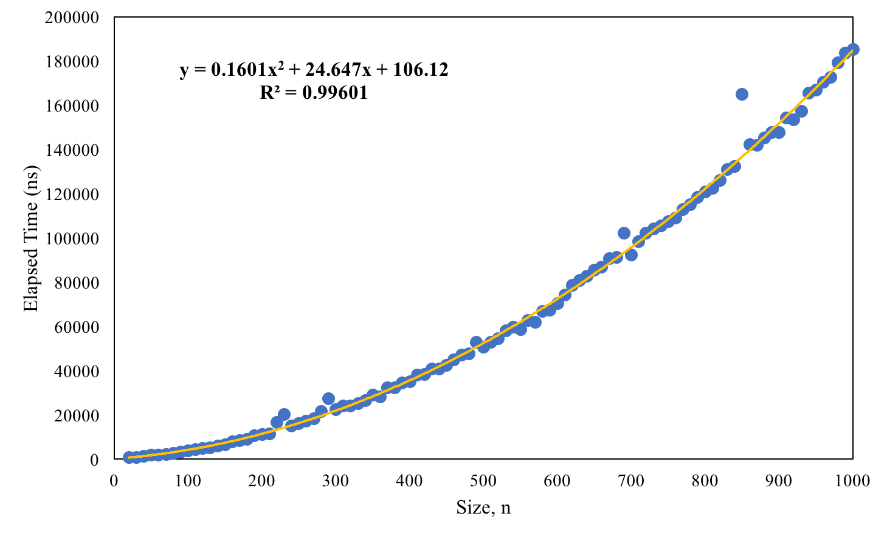

# Assignment 1: Insertion Sort
## Question 2
> In clear, natural language, describe the average runtime of this program after you have empirically tested it with random data up to 1000 values (don’t use debug or your times will be really bad). Calculate an operation cost based on this. Show your data table!

The worst, best, and random input cases are shown in **@Fig:worst**, **@Fig:best**, and **@Fig:rand**, respectively. Using an average over 3000 trials for each array input size, the average run time for the worse case is quadratic, the best case is linear, and random case is quadratic, all as expected. Each figure displays the approx. operation cost as a trendline as represented by the orange curve. 

{#fig:worst width=400px}

{#fig:best width=400px}

{#fig:rand width=400px}

\pagebreak

The table containing selected data points that were used in producing the plots previously showed are displayed in **@Tbl:selected-data** that follows. To see all data points, please refer to **@Tbl:complete-data** in the *Appendix*.

| Size, n | Time (ns) |  Time (ns) |  Time (ns) |
|---------|:---------:|:----------:|:----------:|
| Case    |  Average  |    Best    |    Worst   |
| Sorting |   Random  | Increasing | Decreasing |
| 10      |    612    |     91     |     323    |
| 50      |    1765   |     86     |    2126    |
| 100     |    3846   |     125    |    8734    |
| 200     |   11005   |     185    |    21694   |
| 300     |   22367   |     259    |    43429   |
| 400     |   35006   |     312    |    63759   |
| 500     |   50501   |     334    |   104863   |
| 600     |   70258   |     534    |   144356   |
| 700     |   92267   |     637    |   300179   |
| 800     |   120699  |     745    |   249253   |
| 900     |   147677  |     790    |   325338   |
| 1000    |   185137  |     824    |   375350   |

: Selected data points of average run time (over 3000 trials each) for worst, best, and random case inputs in nanoseconds. {#tbl:selected-data}

\pagebreak
## Question 3
> In clear, natural language, describe how your algorithm’s complexity would change if you changed the algorithm to use a binary search instead of searching previous values until you found where to insert your current value. Describe when this would be useful.

For random case input (i.e. average cases) linear complexity checks inside the inner loop of the insertion sort algorithm become logarithmic instead using a binary search strategy. Since it is nested within a linear complexity outer loop, this results in the overall algorithm to be $n(\text{log}(n) + n) = n\text{log}(n) + n^2$ which is a quadratic time complexity, i.e. the same as the current implemention.

For the sake of completeness, included is a quick summary of the complexities derived from the approx. operational cost for all case inputs. These are explained as follows.

* Format: 
    * Operations $\approx$ "outer-loop runs" $\times$ ("binary-search checks" + "shifts")
* Best case (increasing order): 
    * Operations $\approx n(1 + 1) = n + n = 2n$ which is $\Theta(n)$
* Average case (random order): 
    * Operations $\approx n(\text{log}n + n) = n\text{log}n + n^2$ which is $\Theta(n^2)$
* Worst case (decreasing order): 
    * Operations $\approx n(n + n) = 2n^2$ which is $\Theta(n^2)$

# Appendix

| Size, n | Time (ns) |  Time (ns) |  Time (ns) |
|---------|:---------:|:----------:|:----------:|
| Case    |  Average  |    Best    |    Worst   |
| Sorting |   Random  | Increasing | Decreasing |
| 10      | 612       | 91         | 323        |
| 20      | 628       | 129        | 455        |
| 30      | 754       | 87         | 706        |
| 40      | 1259      | 96         | 1197       |
| 50      | 1765      | 86         | 2126       |
| 60      | 1931      | 138        | 3132       |
| 70      | 2194      | 120        | 3257       |
| 80      | 2732      | 114        | 4608       |
| 90      | 3099      | 120        | 6346       |
| 100     | 3846      | 125        | 8734       |
| 110     | 4298      | 118        | 10607      |
| 120     | 4726      | 158        | 11895      |
| 130     | 5182      | 149        | 15227      |
| 140     | 5886      | 138        | 18321      |
| 150     | 6560      | 156        | 19221      |
| 160     | 7850      | 165        | 18556      |
| 170     | 8420      | 178        | 20248      |
| 180     | 9018      | 168        | 18085      |
| 190     | 10608     | 188        | 19169      |
| 200     | 11005     | 185        | 21694      |
| 210     | 11517     | 180        | 24161      |
| 220     | 16621     | 190        | 24055      |
| 230     | 20215     | 204        | 29665      |
| 240     | 14846     | 280        | 29849      |
| 250     | 16040     | 293        | 31730      |
| 260     | 17245     | 291        | 35135      |
| 270     | 18303     | 234        | 34992      |
| 280     | 21613     | 279        | 50371      |
| 290     | 27403     | 243        | 52569      |
| 300     | 22367     | 259        | 43429      |
| 310     | 23931     | 266        | 43814      |
| 320     | 23893     | 261        | 45239      |
| 330     | 24988     | 252        | 49595      |
| 340     | 26567     | 287        | 52317      |
| 350     | 29054     | 269        | 54372      |
| 360     | 28164     | 282        | 73782      |
| 370     | 32280     | 289        | 57612      |
| 380     | 32353     | 279        | 61079      |
| 390     | 34431     | 298        | 63524      |
| 400     | 35006     | 312        | 63759      |
| 410     | 38003     | 313        | 70779      |
| 420     | 38215     | 314        | 75800      |
| 430     | 40714     | 331        | 84889      |
| 440     | 40753     | 340        | 80952      |
| 450     | 42358     | 329        | 85846      |
| 460     | 44841     | 326        | 90660      |
| 470     | 47082     | 336        | 92679      |
| 480     | 47680     | 358        | 96225      |
| 490     | 52836     | 353        | 102073     |
| 500     | 50501     | 334        | 104863     |
| 510     | 52896     | 353        | 109417     |
| 520     | 54466     | 401        | 113517     |
| 530     | 57995     | 458        | 113709     |
| 540     | 59716     | 466        | 117102     |
| 550     | 58547     | 476        | 120820     |
| 560     | 62683     | 454        | 123097     |
| 570     | 61741     | 480        | 127689     |
| 580     | 66753     | 495        | 134124     |
| 590     | 67277     | 506        | 136583     |
| 600     | 70258     | 534        | 144356     |
| 610     | 74225     | 519        | 149030     |
| 620     | 78607     | 533        | 160307     |
| 630     | 80723     | 532        | 165490     |
| 640     | 82638     | 550        | 165079     |
| 650     | 85487     | 525        | 226163     |
| 660     | 86781     | 565        | 243940     |
| 670     | 90500     | 592        | 276214     |

: Complete data points of average run time (over 3000 trials each) for worst, best, and random case inputs in nanoseconds. {#tbl:complete-data}