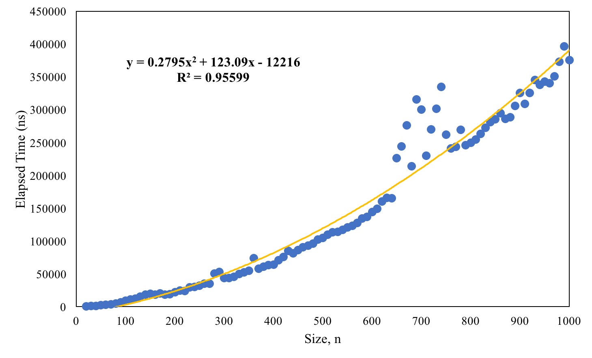

# COMP 352
## Assignment 1: Insertion Sort
By: Tatum Alenko (40055122)

Due: May 15, 2018

### Question 2
> In clear, natural language, describe the average runtime of this program after you have empirically tested it with random data up to 1000 values (don’t use debug or your times will be really bad). Calculate an operation cost based on this. Show your data table!

The worst, best, and random input cases are shown in Figure 1, 2, and 3, respectively. Using an average over 10 trials for each array input size, the average run time for the worse case is quadratic, the best case is linear, and random case is quadratic, all as expected. Although there is some sign of anomolies for input size range between 0 and 600 for worst and random cases, the overall trend is still quadratic. Each figure displays the approx. operation cost as a trendline as represented by the orange curve. 

Figure 1: Worst case input (sorted in decreasing order) run time result averaged over 10 trials per size (data point).

Figure 2: Best case input (sorted in increasing order) run time result averaged over 10 trials per size (data point).

Figure 3: Random case input (no pre-sorting performed) run time result averaged over 10 trials per size (data point).

The table containing some selected data points that were used in producing the plots previously showed are displayed in **Table 1** that follows. To see all data points, please refer to **Table A1** in the *Appendix*.

Table 1. Selected data points of average run time (over 10 trials each) for worst, best, and random case inputs in nanoseconds.
Size  |	Worst (ns) |  Best (ns)  |  Random (ns) 
--  | --        | --       | --
20  |  10392.5  |  2668.1  |  8382.2
50  |  65680.8  |  6771.3  |  42566.8
100  |  155532.2  |  16318.7  |  88807.6
200  |  113682  |  16328.7  |  283894.3
300  |  262107.9  |  24768.6  |  144360.1
400  |  207082.8  |  39351.1  |  347227.9
500  |  130044.2  |  40363.1  |  178334.8
600  |  163138.9  |  50638.3  |  161808.4
700  |  201666.1  |  59096  |  119629.9
800  |  283951.7  |  63415.2  |  156372.3
900  |  420997.9  |  85163.2  |  173940.1
1000  |  441710.6  |  87432.9  |  231755.9

### Question 3
> In clear, natural language, describe how your algorithm’s complexity would change if you changed the algorithm to use a binary search instead of searching previous values until you found where to insert your current value. Describe when this would be useful.

The linear complexity checks inside the inner loop of the insertion sort algorithm becomes a  becomes logarithmic instead using a binary search strategy. Since it is nested within a linear complexity outer loop, this results in the overall algorithm to be of $n~log(n)$ complexity, which is faster than the $n^2$ complexity currently implemented.

## Appendix
Table A1. Complete data points of average run time (over 10 trials each) for worst, best, and random case inputs in nanoseconds.
Size  |	Worst (ns) |  Best (ns)  |  Random (ns) 
--  | --        | --       | --
10	| 639000.9	| 657391   |  633242.2
20  |  10392.5  |  2668.1  |  8382.2
30  |  21832.4  |  3425.2  |  15751.3
40  |  50552.9  |  5347.9  |  30732.7
50  |  65680.8  |  6771.3  |  42566.8
60  |  95941  |  6340.6  |  55779.9
70  |  78891.3  |  9090.5  |  73373.4
80  |  98145.7  |  7848.3  |  62010.5
90  |  131545.8  |  12439.7  |  74969.4
100  |  155532.2  |  16318.7  |  88807.6
110  |  191244.1  |  16188  |  102542.7
120  |  248064.1  |  13336.8  |  122946.9
130  |  290649.1  |  16255.8  |  172399.9
140  |  283760.2  |  27731.3  |  200279.9
150  |  357702.4  |  18384.4  |  182723.7
160  |  240775.6  |  16531.1  |  236009.6
170  |  139162.6  |  16090.6  |  232317
180  |  122785.3  |  14637.1  |  254241.8
190  |  90014.9  |  17313.4  |  293789.8
200  |  113682  |  16328.7  |  283894.3
210  |  147230.4  |  17951.1  |  90053
220  |  133072.5  |  19368.9  |  90583.1
230  |  155919.3  |  18126  |  112118.8
240  |  150868.2  |  19157.3  |  116961.1
250  |  175592.1  |  20228  |  130061.5
260  |  180586  |  21217.3  |  109484
270  |  219618.6  |  24791  |  137950
280  |  238123.2  |  22339.1  |  123440
290  |  242547.3  |  25272.1  |  150029.9
300  |  262107.9  |  24768.6  |  144360.1
310  |  259580.4  |  26334.7  |  164412.6
320  |  284770.3  |  28920.6  |  168259.8
330  |  278577.8  |  38871  |  169807.4
340  |  205202.7  |  36751.4  |  206547.2
350  |  210482.5  |  34039.6  |  251791.2
360  |  202473.7  |  33667  |  258193.4
370  |  206884.5  |  45225.2  |  283385.9
380  |  170057.6  |  36767.7  |  282953.8
390  |  200804.6  |  43812.7  |  271796
400  |  207082.8  |  39351.1  |  347227.9
410  |  197898.6  |  40231.3  |  352967.4
420  |  226661.8  |  51818.2  |  294461.8
430  |  248918.1  |  43959.7  |  230745.3
440  |  236646.9  |  44076.9  |  199272
450  |  244304.7  |  40796.2  |  194622.2
460  |  208921.3  |  43996.9  |  178727.9
470  |  242628.4  |  41744.2  |  187575.6
480  |  182056.1  |  43473.4  |  183408.7
490  |  146765.3  |  44127.5  |  224843.7
500  |  130044.2  |  40363.1  |  178334.8
510  |  142319  |  39754.8  |  193667.3
520  |  138634.3  |  41624.3  |  194809.9
530  |  142895.1  |  42412.9  |  206024.7
540  |  145974.5  |  41543.4  |  212674.5
550  |  144988.2  |  44985.3  |  195645.8
560  |  166132.9  |  42015.1  |  246079.9
570  |  178529.8  |  47826.5  |  194611.2
580  |  153947.3  |  42699.1  |  198652.5
590  |  141958.9  |  56353.1  |  171513.2
600  |  163138.9  |  50638.3  |  161808.4
610  |  155455.4  |  55940.3  |  172112.1
620  |  159550.6  |  54453.1  |  155604.3
630  |  167518.7  |  57948.8  |  118560.1
640  |  168257.5  |  54498.1  |  128041.4
650  |  165544.7  |  54558.4  |  112793.6
660  |  183418.4  |  61867.3  |  115017.7
670  |  193600  |  61721.5  |  113953.9
680  |  177837.2  |  57975.7  |  124848.6
690  |  181364.3  |  57858.6  |  123939.4
700  |  201666.1  |  59096  |  119629.9
710  |  218504.7  |  62087.4  |  128353.8
720  |  206471.5  |  59897.3  |  132438.5
730  |  252372.5  |  59139.5  |  132501.3
740  |  239370.2  |  60718.4  |  138170
750  |  337261.7  |  61226.9  |  141987.1
760  |  292335.9  |  66609.8  |  142876.9
770  |  284041.1  |  60972  |  135815.2
780  |  282565.2  |  64076.5  |  138596.3
790  |  295495.2  |  67735.3  |  148990.8
800  |  283951.7  |  63415.2  |  156372.3
810  |  304717.8  |  69271.8  |  158306.3
820  |  316831.6  |  76098.6  |  155295.5
830  |  336602.2  |  70871.2  |  157164.3
840  |  343198.1  |  63281.8  |  165603
850  |  372351.6  |  77560.7  |  159982.6
860  |  326411.5  |  72914.5  |  180169.1
870  |  407038.3  |  83440.9  |  173603.4
880  |  383701.6  |  94765.3  |  184292.1
890  |  363543.2  |  75115.6  |  181605.6
900  |  420997.9  |  85163.2  |  173940.1
910  |  398658.2  |  88739  |  180322.7
920  |  366555.2  |  76494.2  |  189092.1
930  |  481330.6  |  82572.1  |  181850.3
940  |  409210.8  |  74026.8  |  189533.4
950  |  390257  |  81403.2  |  200998.9
960  |  397658.7  |  77319.7  |  203278.3
970  |  390158.3  |  85582.7  |  215550.1
980  |  404468.2  |  88347.3  |  225444
990  |  439551.5  |  81962.4  |  226645.3
1000  |  441710.6  |  87432.9  |  231755.9